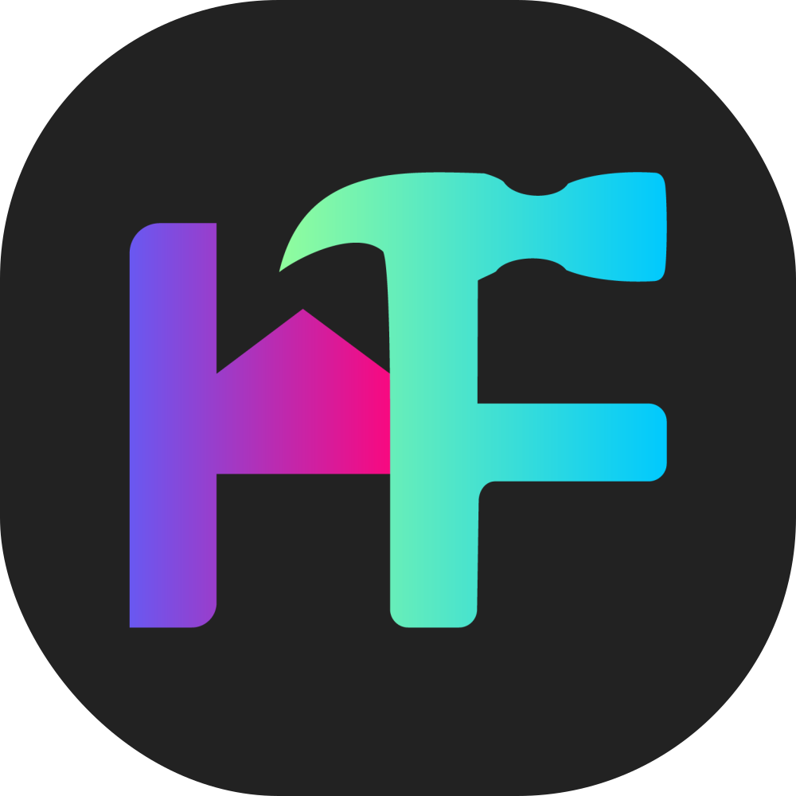

<p align="center">
  
</p>

<h1 align="center">HomeForge</h1>

<p align="center">
  <strong>🏠 Open-Source Smart Home Management Platform for DIY IoT Enthusiasts</strong>
</p>
<center>
  <a href="#features">Features</a> •
  <a href="#quick-start">Quick Start</a> •
  <a href="#architecture">Architecture</a> •
  <a href="#documentation">Documentation</a> •
  <a href="#contributing">Contributing</a>
</center>


<center>
  
  
  
  
  
  
  
</center>


---

## 🎯 Overview

**HomeForge** is a self-hosted smart home management system designed for makers, hobbyists, and DIY IoT enthusiasts. Build your own smart home dashboard without vendor lock-in.

Unlike commercial solutions, HomeForge gives you complete control over your devices, data, and automations—all running on your own hardware.

---

## ✨ Features

### 🎛️ Device Management
- **Universal Device Support** — Register any IoT device with flexible JSON state
- **Visual Device Builder** — Design custom device configurations via drag-and-drop
- **Real-time Control** — Toggle switches, sliders, and gauges with instant "Smart Sync" feedback
- **Custom Device Types** — Propose and approve new device categories
- **Enhanced Device Cards** — Visual status indicators with offline overlay and disabled controls
- **Advanced Drag & Drop** — iOS-style organization with 3-zone drop targets (insert/merge)

### 🗺️ Network Topology
- **Interactive Visualization** — React Flow-powered network graph
- **Radial Layout** — Gateway-centered star topology view
- **Live Status** — Color-coded connections (online/offline/error)

### 👥 Multi-User System
- **Role-Based Access** — Owner, Admin, User, and Viewer roles
- **Profile Customization** — Avatars, accent colors, and themes
- **JWT Authentication** — Secure token-based auth with refresh flow

### 🔔 Notification System
- **Real-time Alerts** — Device events, approvals, and system messages
- **Priority Levels** — Low, normal, high, and urgent notifications
- **Multi-type Support** — Device status, admin approvals, warnings, errors
- **Read Tracking** — Mark as read with timestamps and bulk actions
- **Admin Broadcasts** — Send notifications to all users or specific roles

### 🏗️ Room Organization
- **Physical Grouping** — Organize devices by location
- **Room Dashboard** — View all devices in a room at a glance
- **Drag & Drop** — Easy device-to-room assignment

### 🎨 Modern UI/UX
- **Dark/Light Mode** — System-aware theme switching
- **Glassmorphism Design** — Modern translucent UI elements
- **Responsive Layout** — Desktop and mobile optimized
- **shadcn/ui Components** — Accessible, customizable components

### 🔧 Developer Friendly
- **RESTful API** — Complete API v1.3.0 with comprehensive documentation
- **React Query Caching** — Optimized data fetching with 30s stale time
- **Docker Ready** — One-command deployment with Docker Compose
- **Dev Containers** — VS Code development containers included
- **Debug Tools** — Built-in debug page for testing device states
- **Extensible** — Clean architecture for custom integrations

---

## 🚀 Quick Start

### Prerequisites

- [Docker](https://www.docker.com/get-started) & Docker Compose
- [Git](https://git-scm.com/)

### One-Command Setup

```bash
# Clone the repository
git clone https://github.com/yourusername/homeforge.git
cd homeforge

# Start all services
docker compose up -d --build

# The application is now running:
# 🌐 Frontend: http://localhost:3000
# 🔌 Backend:  http://localhost:8000
# 📊 Database: localhost:5432
```

### First User Setup

The **first registered user** automatically becomes the system **Owner** with full administrative privileges.

1. Open http://localhost:3000/register
2. Create your account
3. You're now the system owner with access to the Admin Panel

---

## 📁 Project Structure

```
HomeForge/
├── 📂 backend/                 # Django REST API
│   ├── api/                    # Main application
│   │   ├── models.py           # Data models
│   │   ├── views.py            # API endpoints
│   │   ├── serializers.py      # DRF serializers
│   │   └── permissions.py      # RBAC permissions
│   ├── my_backend/             # Django settings
│   ├── API_GUIDE.md            # Complete API reference
│   ├── BACKEND_README.md       # Backend documentation
│   └── Dockerfile
│
├── 📂 frontend/                # Next.js React App
│   ├── app/                    # App Router pages
│   │   ├── dashboard/          # Protected routes
│   │   │   ├── devices/        # Device management
│   │   │   ├── device-builder/ # Visual device designer
│   │   │   ├── topology/       # Network visualization
│   │   │   └── admin/          # Admin panel (rooms, users, device-types, debug)
│   │   ├── login/              # Authentication
│   │   └── register/
│   ├── components/             # React components
│   │   ├── ui/                 # shadcn/ui primitives
│   │   ├── devices/            # Device components (SmartDeviceCard)
│   │   └── topology/           # Graph visualization
│   ├── lib/                    # Utilities & API client
│   ├── frontend_readme.md      # Frontend documentation
│   └── Dockerfile
│
├── 📂 .github/                 # GitHub configurations
│   └── copilot-instructions.md # AI coding guidelines
│
├── docker-compose.yml          # Service orchestration
└── README.md                   # This file
```

---

## 🏗️ Architecture

```
┌─────────────────────────────────────────────────────────────────────┐
│                         FRONTEND (Next.js 16+)                       │
│   ┌─────────────┐  ┌─────────────┐  ┌─────────────┐  ┌───────────┐  │
│   │  Dashboard  │  │  Topology   │  │   Device    │  │   Admin   │  │
│   │    Pages    │  │   Canvas    │  │   Builder   │  │   Panel   │  │
│   └─────────────┘  └─────────────┘  └─────────────┘  └───────────┘  │
│                              │                                       │
│                    React Query + API Client                          │
└──────────────────────────────┼──────────────────────────────────────┘
                               │ HTTP/REST + JWT
                               ▼
┌─────────────────────────────────────────────────────────────────────┐
│                      BACKEND (Django 5.x + DRF)                      │
│   ┌─────────────┐  ┌─────────────┐  ┌─────────────┐  ┌───────────┐  │
│   │    Auth     │  │   Devices   │  │    Rooms    │  │  Topology │  │
│   │   (JWT)     │  │   (CRUD)    │  │   (CRUD)    │  │   (Graph) │  │
│   └─────────────┘  └─────────────┘  └─────────────┘  └───────────┘  │
│                              │                                       │
│                         Django ORM                                   │
└──────────────────────────────┼──────────────────────────────────────┘
                               │
                               ▼
┌─────────────────────────────────────────────────────────────────────┐
│                        POSTGRESQL 15                                 │
│   ┌──────────┐  ┌──────────┐  ┌──────────┐  ┌────────────────────┐  │
│   │  Users   │  │  Rooms   │  │ Devices  │  │ CustomDeviceTypes  │  │
│   │ Profiles │  │          │  │  States  │  │   CardTemplates    │  │
│   └──────────┘  └──────────┘  └──────────┘  └────────────────────┘  │
└─────────────────────────────────────────────────────────────────────┘
                               │
                               │ Future: MQTT / ESPHome
                               ▼
┌─────────────────────────────────────────────────────────────────────┐
│                        IOT HARDWARE LAYER                           │
│            ESP32 / ESP8266 / Raspberry Pi / DIY Devices             │
└─────────────────────────────────────────────────────────────────────┘
```

---

## 🛠️ Technology Stack

### Backend

| Technology | Version | Purpose |
|------------|---------|---------|
| Python | 3.12+ | Runtime environment |
| Django | 5.x | Web framework |
| Django REST Framework | Latest | RESTful API |
| PostgreSQL | 15 | Primary database |
| SimpleJWT | Latest | JWT authentication |

### Frontend

| Technology | Version | Purpose |
|------------|---------|---------|
| Next.js | 16+ | React framework (App Router) |
| React | 19 | UI library |
| TypeScript | 5+ | Type safety |
| Tailwind CSS | 4 | Utility-first styling |
| shadcn/ui | Latest | Component library |
| React Flow | Latest | Graph visualization |
| TanStack Query | Latest | Server state management |

### Infrastructure

| Technology | Purpose |
|------------|---------|
| Docker | Containerization |
| Docker Compose | Multi-container orchestration |
| PostgreSQL | Persistent data storage |
| Nginx | Reverse proxy (production) |

---

## 📖 Documentation

| Document | Description |
|----------|-------------|
| [Backend README](backend/backend_readme.md) | Backend architecture, models, and setup |
| [Frontend README](frontend/frontend_readme.md) | Frontend architecture, components, and patterns |
| [Wiki Website](website/README.md) | Docusaurus documentation site and deployment |
| [API Guide](backend/API_GUIDE.md) | Complete API reference with examples |
| [Frontend API Usage](frontend/API_USAGE.md) | Frontend apiClient.js usage guide |
| [Copilot Instructions](.github/copilot-instructions.md) | AI coding guidelines and conventions |

---

## 🔧 Development

### Using Dev Containers (Recommended)

This project includes Dev Container configurations for VS Code:

1. Install [VS Code](https://code.visualstudio.com/) and the [Dev Containers extension](https://marketplace.visualstudio.com/items?itemName=ms-vscode-remote.remote-containers)
2. Open the `backend/` or `frontend/` folder
3. Click "Reopen in Container" when prompted

### Manual Setup

#### Backend

```bash
cd backend
python -m venv venv
source venv/bin/activate  # Windows: venv\Scripts\activate
pip install -r requirements.txt
python manage.py migrate
python manage.py runserver
```

#### Frontend

```bash
cd frontend
npm install
npm run dev
```

### Running Tests

```bash
# Backend tests
cd backend
python manage.py test

# Frontend tests
cd frontend
npm run test
```

---

## 🔐 Environment Variables

### Backend

| Variable | Default | Description |
|----------|---------|-------------|
| `DB_NAME` | `HomeForge` | PostgreSQL database name |
| `DB_USER` | `myuser` | Database user |
| `DB_PASS` | `mypassword` | Database password |
| `DB_HOST` | `db` | Database host |
| `DJANGO_DEBUG` | `True` | Debug mode |

### Frontend

| Variable | Default | Description |
|----------|---------|-------------|
| `NEXT_PUBLIC_API_URL` | Auto-detected | Backend API URL |

---

## 🗺️ Roadmap

### In Progress
- [ ] Real-time updates via WebSockets
- [ ] MQTT device integration
- [ ] ESPHome native support

### Planned
- [ ] Automation engine (rules & triggers)
- [ ] Scene management (presets)
- [ ] Energy monitoring
- [ ] Mobile app (React Native)
- [ ] Voice assistant integration
- [ ] Backup & restore

---

## 🤝 Contributing

We welcome contributions! Please see our contributing guidelines:

1. **Fork** the repository
2. **Create** a feature branch (`git checkout -b feat/amazing-feature`)
3. **Commit** using [Conventional Commits](https://www.conventionalcommits.org/)
   ```
   feat(frontend): add device card component
   fix(backend): resolve token refresh issue
   docs(api): update endpoint documentation
   ```
4. **Push** to your branch (`git push origin feat/amazing-feature`)
5. **Open** a Pull Request

### Commit Convention

| Type | Description |
|------|-------------|
| `feat` | New feature |
| `fix` | Bug fix |
| `docs` | Documentation |
| `style` | Formatting (no code change) |
| `refactor` | Code restructuring |
| `test` | Adding tests |
| `chore` | Maintenance |

---

## 📜 License

This project is open source and available under the [MIT License](LICENSE).

---

## 🙏 Acknowledgements

- [Django REST Framework](https://www.django-rest-framework.org/)
- [Next.js](https://nextjs.org/)
- [shadcn/ui](https://ui.shadcn.com/)
- [React Flow](https://reactflow.dev/)
- [Tailwind CSS](https://tailwindcss.com/)
- [Lucide Icons](https://lucide.dev/)

---

<p align="center">
  Made with ❤️ for the DIY Smart Home Community
</p>

<p align="center">
  <a href="#homeforge">⬆ Back to Top</a>
</p>

---

## 📋 Changelog

### [2026-03-24] - v1.7.0
- **Added**: HomeForge Docusaurus wiki scaffold in `website/` with Overview, Backend, Frontend, and API Usage starter pages
- **Added**: GitHub Actions workflow for docs deployment at `.github/workflows/deploy-docs.yml`
- **Changed**: Root, backend, frontend, and website README files updated with HomeForge logo branding
- **Changed**: Docusaurus branding assets switched to HomeForge favicon/logo and social card images
- **Changed**: Frontend metadata and sidebar branding updated to use HomeForge logo pack under `frontend/public/logos/`

### [2026-02-24] - v1.6.1
- **Added**: "Smart Sync" optimistic UI for device toggles with server state verification
- **Added**: 3-zone drop system for device grid (left/right insert, center merge)
- **Added**: iOS-style folder creation with merge animation and absorb effect
- **Changed**: Device card interactions disabled during sync state to preventing race conditions
- **Changed**: Grid alignment to `items-start` prevents height stretching of smaller cards
- **Fixed**: Drag-and-drop glitches with new dynamic grip icon and centered drop targets

### [2026-02-15] - v1.6.0
- **Added**: 3-zone drop system for device grid organization
- **Added**: iOS-style folder creation with visual absorb animation
- **Changed**: API Guide updated to v1.6.0
- **Changed**: Edit Layout mode moved to grouping dropdown menu
- **Fixed**: React Query cache leak between user sessions on logout
- **Fixed**: Grid alignment issues with variable height cards

### [2026-02-04] - v1.4.1 (Latest)
- **Added**: `proposed_by` field to CustomDeviceType model to track who submitted device types
- **Added**: Device type detail view shows proposer username with link to user profile
- **Added**: Users page search and filter functionality (by name, email, role)
- **Added**: Users page URL deep linking (`?user=1` or `?username=johndoe`)
- **Added**: Save name mutation for device types (save without approving)
- **Changed**: Notification center now clears cache on logout and refetches on login
- **Changed**: Notifications only fetch when user is logged in
- **Changed**: Device types page shows "Requested by" / "Created by" with clickable username
- **Changed**: API version updated to v1.4.0 with `proposed_by` and `proposed_by_username` fields
- **Fixed**: Notification cache invalidation on user session changes
- **Fixed**: Device types page text truncation for long names

### [2026-02-04] - v1.4.0
- **Added**: Smart auto-generate algorithm for Device Builder with intelligent layout rules
- **Added**: Sensor layout strategy based on count (1=row large, 2=square medium, 3+=grid hierarchy)
- **Added**: Special sensor rules (motion always medium, temp/humidity pairs match)
- **Added**: Control sizing strategy based on count (1=large, 2-3=medium, 4+=small)
- **Changed**: Device Builder widget sizes now work correctly (Small/Medium/Large)
- **Changed**: Square widgets Large size now spans 2x2 grid cells
- **Changed**: Row widgets use explicit heights (Small=48px, Medium=56px, Large=80px)
- **Changed**: Debug panel device cards now fully clickable to expand/collapse
- **Fixed**: Row widget filter changed from `variant !== 'square'` to explicit `variant === 'row'`
- **Removed**: Unused "compact" layout variant from Device Builder
- **Removed**: Error status from Debug panel (per UX feedback)

### [2026-02-02] - v1.3.1
- **Fixed**: Dashboard "No Devices" flash during API refetches with module-level cache
- **Fixed**: Notification URL transformation for device type deep linking
- **Fixed**: DevContainer setup with improved run scripts for backend and frontend
- **Changed**: Dashboard loading logic now uses `cachedDevicesExist` to persist device state
- **Changed**: Added `staleTime: 2000` to devices query to reduce unnecessary refetches
- **Changed**: Array safety checks with `Array.isArray()` for devices/rooms/deviceTypes
- **Changed**: Run scripts simplified (removed shebang and `set -e` for broader compatibility)
- **Removed**: Badge counts from sidebar (consolidated into notification system)
- **Removed**: Polling for pending device types in sidebar (notifications handle this)

### [2026-02-02] - v1.3.0
- **Added**: Notification System with full API integration (create, read, mark as read, delete)
- **Added**: Notification Center component with bell icon in sidebar footer
- **Added**: Real-time unread count badge with 30-second polling
- **Added**: Multi-type notifications (device events, approvals, system messages)
- **Added**: Priority levels support (low, normal, high, urgent)
- **Added**: Unified Device Types Management page with status filter dropdown
- **Added**: URL filter support for device types (`?filter=pending`)
- **Added**: Custom scrollbars matching shadcn/ui aesthetic
- **Added**: Mobile device type selector dropdown
- **Changed**: Migrated all pages to React Query for improved caching and performance
- **Changed**: Skeleton loading states replace spinners for better perceived performance
- **Changed**: Client-side navigation using Next.js Link components throughout
- **Changed**: Topology canvas background now properly respects theme colors
- **Changed**: Notification bell moved to sidebar footer next to user avatar
- **Removed**: Separate Approvals and Denied Types pages (consolidated into Device Types)
- **Removed**: Badge counts from sidebar menu items (notifications handle this now)

### [2026-02-01] - v1.2.0
- **Added**: Extended widget types for sensors (TEMPERATURE, HUMIDITY, MOTION, LIGHT, CO2, PRESSURE, POWER, BATTERY, STATUS)
- **Added**: SensorWidgets component with color-coded displays
- **Added**: Tap-to-toggle behavior for single-toggle devices (Home Assistant style)
- **Added**: Auto-generate widgets from topology sensors in Device Builder
- **Added**: Drag-and-drop widget reordering with dnd-kit
- **Added**: Widget layout options (row/square variants, 1-2 column grids)
- **Added**: Pending approval count badge in admin sidebar
- **Added**: Admin review mode for approving device types in builder
- **Added**: Frontend CHANGELOG.md
- **Changed**: API updated to v1.2.0 with extended widget types
- **Changed**: Improved mobile responsiveness across all pages
- **Changed**: SmartDeviceCard now supports square/row widget layouts
- **Changed**: AddDeviceDialog generates initial_state from device type structure

### [2026-02-01] - v1.1.0
- **Added**: Admin device type editing (GET/PUT/PATCH endpoints)
- **Added**: Device Builder edit mode for modifying existing device types
- **Added**: Debug page in admin panel for testing device states
- **Added**: Frontend API usage guide (`frontend/API_USAGE.md`)
- **Changed**: Enhanced SmartDeviceCard UI with better offline visual states
- **Changed**: Device controls now properly disable when offline
- **Removed**: Mock data generation from topology endpoint
- **Added**: GitHub Copilot instructions for consistent code generation
- **Added**: MCP server configurations for enhanced AI assistance
- **Added**: Comprehensive project documentation

### [2026-01-15]
- **Added**: Device Builder with drag-and-drop interface
- **Added**: Custom Device Type proposal workflow
- **Added**: Device control system with JSON state

### [2026-01-01]
- **Added**: Initial release with core features
- **Added**: JWT authentication system
- **Added**: Room and device management
- **Added**: Network topology visualization
